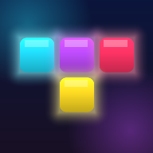

# TETRISH — パチスロ風落ちものパズル



PC（ブラウザ）とスマホ（iPhone / Android）の両方で遊べる、依存ライブラリゼロの落ちものパズルです。
ガイドライン準拠の操作感（SRS・7bag・ホールド・ゴースト・ロックディレイ）の上に、
**パチスロの演出構造**を丸ごと載せました。

**ビルド不要 / 外部アセットなし / オフライン動作（PWA）**

---

## あそびかた

### スマホ

| 操作 | 動き |
| --- | --- |
| 左右にドラッグ | 指の動きにブロックが追従 |
| 下にドラッグ | ソフトドロップ |
| 下にフリック | ハードドロップ |
| 上にフリック | ホールド |
| タップ | 右回転（画面左端をタップで左回転） |

画面下のボタンでも操作できます。横向きでもプレイ可能（ボタンは左右の下端に移動）。

### PC

| キー | 動き |
| --- | --- |
| <kbd>←</kbd> <kbd>→</kbd> / <kbd>A</kbd> <kbd>D</kbd> | 移動 |
| <kbd>↓</kbd> / <kbd>S</kbd> | ソフトドロップ |
| <kbd>Space</kbd> | ハードドロップ |
| <kbd>↑</kbd> <kbd>X</kbd> <kbd>W</kbd> | 右回転 |
| <kbd>Z</kbd> <kbd>Ctrl</kbd> | 左回転 |
| <kbd>Q</kbd> | 180°回転 |
| <kbd>C</kbd> <kbd>Shift</kbd> | ホールド |
| <kbd>Esc</kbd> <kbd>P</kbd> | ポーズ |
| <kbd>R</kbd> | やりなおす |

ゲームパッドにも対応しています。

---

## パチスロ演出

ライン消しは「遊技」、その先にあるのは**ボーナス**です。

### 抽選 → 前兆 → フリーズ → リール

1. **CHANCEゲージ** — ラインを消すと溜まる。T-Spin やテトリスは大きく溜まる
2. **前兆** — 62%を超えると告知ランプが点滅し、BGMが前兆曲に変わる
3. **フリーズ** — 満タンで画面が白飛びして**ゲームが止まる**
4. **リール** — 3連リールが降りてきて回る。左・右が止まって**テンパイ**
5. **スベリ（昇格）** — 中リールが止まりかけてから滑る。滑るほど上位

| 中リール | ボーナス | 継続 | 倍率 |
| --- | --- | --- | --- |
| **青7** で止まる | REGULAR BONUS | 12G | ×2 |
| **赤7** へ1コマ滑る | BIG BONUS | 30G | ×3 |
| **虹7** へもう1コマ滑る | PREMIUM BONUS | 60G | ×5 |

最低保証は REG。**ハズレはありません**。緊張するのは「どこまで昇格するか」です。

### 保留（NEXT の枠色）

NEXT に積まれるミノには期待度が割り振られ、枠の色で表示されます。

白 → **青** → **緑** → **赤** → **虹**

赤保留のミノが降りてくるとゲージが大きく跳ね、**虹保留が出たらボーナス確定**です。

### ボーナス中：上乗せ

**1G = ミノ1個**。残りGが0になると終了します。
ボーナス中に **2ライン以上** 消すと残りGが増えます（＝上乗せ）。

| | 上乗せ |
| --- | --- |
| ダブル | +3G |
| トリプル | +8G |
| **TETRIS** | **+25G** |
| T-Spin | +20G |
| **パーフェクトクリア** | **+100G** |

シングルでは乗りません。**まとめて消すほどボーナスが伸びます**（コンボ中はさらに増加）。

### 確定ルート

- **パーフェクトクリア** → PREMIUM 確定
- **T-Spin トリプル** → BIG 以上確定
- **虹保留** → PREMIUM 確定

### そのほかの演出

- **ステップアップ予告** — コンボが続くと STEP1〜4 が段階的に出る（白→青→緑→赤）
- **カットイン** — 激アツ時に画面を横切る帯
- **集中線** — 熱くなると放射状の線が走る
- **ヒットストップ** — 着地・ライン消し・昇格の瞬間に画面が止まる（設定でOFF可）
- **画面シェイク** — 縦横に加えて**回転**方向にも揺れる。パンチズームつき
- **告知ランプ** — 上部バーのランプが前兆・テンパイ・ボーナスで色と点滅速度を変える
- **ビート同期** — ボーナス中は盤面がBGMの4分音符に合わせて光る

そのほか、ピンチ時の赤色警告、ハイスコア更新の祝福、ランク判定（D〜SSS）、
バイブレーション（対応端末）。

## BGM

音は **すべて WebAudio でその場で合成** しています（音声ファイルは 1 つもありません）。
音色はファミコン風のチップチューンで、実機の4チャンネル構成にならって声部を割り当てています。

| チャンネル | 担当 | 音色 |
| --- | --- | --- |
| パルス1 | メロディ | デューティ比 25% のパルス波＋ビブラート |
| パルス2 | 分散和音 | デューティ比 12.5% のパルス波 |
| 三角波 | ベース | triangle |
| ノイズ | ドラム | フィルタつきノイズ |

デューティ比つきのパルス波は `PeriodicWave` で作っています。矩形パルスのフーリエ級数は
cos 項のみで n 次の係数が `(2 / (n * PI)) * sin(n * PI * duty)` になるので、これを渡すと
折り返しノイズの出ない波が得られます。矩形波（50%）だけだと「ピコピコ」の幅が出ません。

### 3つのトラック

ハ長調で、通常時もボーナスも明るく。**前兆だけ**あえて陰らせてあり、
その数秒があることでボーナスの明るさが際立つようにしてある。

| トラック | いつ | BPM | 中身 |
| --- | --- | --- | --- |
| **通常** | ふだん | 152 → 174 | 明るく軽やか。C-G-Am-F-C-G-F-G |
| **前兆** | ゲージ62%以上 | 160 → 180 | ここだけ短調。ライザーとタム回しで不安を積む |
| **ボーナス** | ボーナス中 | **184 → 200** | 4つ打ち＋ガロップベース。16小節 |

BPM はレベルで上がり、さらにトラックが切り替わると段が付く。
ボーナス突入では最低でも **+32 BPM** 跳ね上がる。

### ボーナス曲の作り

Aメロは同じ音を3つ連ねてから跳ぶ覚えやすい動機、サビは**王道進行**（F-G-Em-Am）。
メロディは **A6（1760Hz）** まで駆け上がる。

| | Aメロ | サビ | 差 |
| --- | --- | --- | --- |
| 音圧 (RMS) | 0.212 | 0.216 | +0.1 dB（音量では殴らない） |
| 明るさ (スペクトル重心) | 2306 Hz | 3026 Hz | **+720 Hz** |
| 高域 >3kHz | 21.0% | 24.6% | +3.6 pt |
| 中域 250Hz-3kHz | 26.9% | 23.5% | −3.4 pt（中域が空いて見通しが良くなる） |
| 低域 <250Hz | 52.1% | 51.9% | 据え置き（ベースは走り続ける） |
| メロディ平均音高 | 78.5 | 87.6 | **+9.2 半音** |

**リズム** — キックは4つ打ち。ベースはその隙間を突く16分のガロップ
（`_ _ 0 12` の繰り返し）なので、キックとぶつからずに一度も休まない。
オフビートにオープンハットを置いてシズルを足している。

**ベース** — 「効かせる」のは音量より帯域の広さで決まる。同じ高さに
三角波・25%パルス・1オクターブ下のサイン波を3枚重ねて、低域の比率を 52% まで持ち上げた。

### 作るうえで気をつけたこと

- **休符を入れる** — 16分を詰め続けると歌にならない。通常4.6音／ボーナス5.8音の小節平均に抑え、
  同じリズムを繰り返してフックにしている（ボーナスは最頻リズムが9回反復）
- **声部を近くで動かす** — 和音を転回させ、隣のコードとの移動量を通常4半音／ボーナス6半音以内に
- **和音をなぞらない** — 9th/11th/13th を混ぜて非和声音を32〜36%に。コードの構成音だけを
  上下させると打ち込み練習曲になる
- **伸ばす音を作る** — エンベロープの `hold` と、長い音だけにかかるビブラート
- **分散和音を拍に乗せる** — 構成音3つを16ステップに敷くと 3対4 で拍とぶつかる
- **ヘッドルームを残す** — ベースとドラムを上げたぶん全体を下げる。
  レンダリングしてピークが 0.89、クリップ0であることを確認している

## 動かす

静的ファイルだけなので、適当な HTTP サーバーで配信するだけです。

```sh
python3 -m http.server 8000
# → http://localhost:8000
```

> ES モジュールを使っているため、`index.html` をファイルとして直接開く（`file://`）と動きません。
> かならず HTTP 経由で開いてください。

### 単一 HTML にまとめる

CSS と JS をすべて埋め込んだ 1 ファイルを書き出せます。
サーバー不要で、ダブルクリックしただけで遊べます（メール添付やチャットで配るのに便利）。

```sh
node tools/bundle.mjs
# → dist/tetrish.html
```

### スマホで遊ぶ

同じ Wi-Fi 上で PC の IP を指定してアクセスするか、GitHub Pages 等に置いてください。
ブラウザの「ホーム画面に追加」でフルスクリーンのアプリとして遊べます（PWA / オフライン対応）。

### GitHub Pages で公開する

`.github/workflows/pages.yml` を同梱しています。
リポジトリの **Settings → Pages → Source** を **GitHub Actions** に設定すると、
`main` への push で自動的に公開されます。

---

## テスト

エンジン（当たり判定・SRS・スコア・T-Spin・パーフェクトクリアなど）は
ブラウザなしでテストできます。

```sh
node --test
```

---

## 構成

```
index.html              画面の骨組み
css/style.css           ネオンUI・レスポンシブ・演出アニメーション
js/
  main.js               司令塔。エンジンのイベントを演出・音・振動へ配る
  pachi.js              パチスロ演出のディレクター（フリーズ・リール・保留・上乗せ）
  game.js               コアエンジン（盤面・SRS・スコア・ボーナス）。描画非依存
  pieces.js             ミノ定義と SRS キックテーブル
  renderer.js           Canvas2D 描画（ブロックはスプライトキャッシュ）
  effects.js            パーティクル・衝撃波・画面シェイク
  audio.js              WebAudio によるBGMとSFXの合成
  input.js              キーボード（DAS/ARR）・タッチ・ボタン・ゲームパッド
  storage.js            設定とハイスコアの保存
tests/engine.test.mjs   エンジンのテスト
tools/bundle.mjs        単一HTMLへまとめるビルダー
sw.js                   オフライン用 Service Worker
```

### 設計メモ

- `game.js` は描画・音・DOM を一切知らず、`emit()` でイベントを流すだけ。
  演出はすべて `main.js` が受け取って組み立てるので、ロジックだけをテストできます。
- ブロックはセルサイズごとに一度だけ描いた canvas を使い回します。
  全ブロックに `shadowBlur` とグラデーションをかけると激重になるためです。
- 全画面の `filter: blur()` / `backdrop-filter` は毎フレーム再合成されて重いので使っていません
  （これだけで最悪ケースが 20fps → 58fps になりました）。
- 設定の「エフェクト量」でパーティクル数と解像度を落とせます。
  「ヒットストップ」「画面を揺らす」も個別にOFFにできます。
- 演出は `pachi.js` のディレクターが持つ小さなタイムライン（`at(遅延, 関数)`）で組み立てています。
  ゲームを完全に止める**フリーズ**と、一瞬だけ止める**ヒットストップ**を分けて扱い、
  フリーズ中も演出のタイムラインとリールだけは動き続けます。
